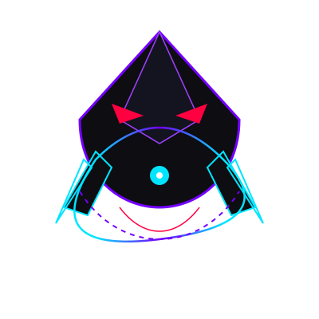

<div align="center">
  
  
  <h1>🧙‍♂️ GitWeaver Orchestrator</h1>
  
  <p><b>Weaving code, logic, and LLMs into a seamless thread.</b></p>
  
  <p>
    <code>orchestrator</code> is a local Node.js + TypeScript CLI-of-CLIs runtime powering workflows for <b>Codex</b>, <b>Claude</b>, and <b>Gemini</b>.
  </p>
  
  <p>
    <a href="#-features">Features</a> •
    <a href="#-setup--installation">Setup</a> •
    <a href="#-commands">Commands</a> •
    <a href="#-validation">Validation</a>
  </p>
</div>

<br/>

## ✨ Features

- **Multi-Provider Mastery**: Seamlessly cast workflows using Codex, Claude, and Gemini in a single CLI space.
- **Git Native Magic**: Runs naturally require a pristine git repository baseline. Merge integrations are commit-based and guarded by semantic scope and strict verification gates.
- **Enchanted Logging**: Every event is tracked and safely preserved locally in `.orchestrator/runs/<run-id>/events.ndjson`.
- **Absolute Drift Control**: Embedded baseline repair and strict drift-acceptance workflows ensure your digital tapestry remains untangled.

## 🚀 Setup & Installation

Summon your local environment in seconds.

```bash
pnpm install
pnpm build
```

**Run an objective in dev mode:**

```bash
pnpm dev run "your objective"
```

## 🛠 Commands

Weave your magic with these primary CLI commands:

| Command | Description |
|:---|:---|
| `orchestrator run "<prompt>"` | Start a new workflow. Custom flags: `--concurrency N`, `--dry-run`, `--config path`, `--repo path`, `--allow-baseline-repair`, `--accept-drift` |
| `orchestrator resume <run-id>` | Resume an existing run. Flag: `--accept-drift` |
| `orchestrator status <run-id>` | Check run status (`--json` supported) |
| `orchestrator inspect <run-id>` | Inspect run details (`--task <id>`, `--json`) |
| `orchestrator locks <run-id>` | Check current locks (`--json`) |
| `orchestrator providers check` | Check provider configurations (`--json`) |
| `orchestrator providers install`| Install providers e.g. `--providers codex,claude,gemini` (`--yes`, `--json`) |
| `orchestrator providers auth` | Authenticate via `--provider codex\|claude\|gemini` (`--fix`, `--json`) |

## 📦 Provider Install Defaults

GitWeaver installs provider dependencies automatically using standard NPM packages:

- **Codex**: `npm install -g @openai/codex@latest`
- **Claude**: `npm install -g @anthropic-ai/claude-code@latest`
- **Gemini**: `npm install -g @google/gemini-cli@latest`

## 🧪 Validation

Ensure your weaving is flawless before merging:

```bash
pnpm typecheck
pnpm build
pnpm test
```

> **Note:** CI runs the exact same validation pipeline via `.github/workflows/ci.yml`.

---
<div align="center">
  <i>Built with magic and code.</i> 🌟
</div>
