# GitWeaver System Flowcharts

A comprehensive visual reference for the orchestrator's internal flow — provider routing, quota fallback, task execution pipeline, agent coordination, Claude sub-model selection, and reasoning level control.

---

## 1. System Architecture Overview

How all the major components relate to each other at rest.

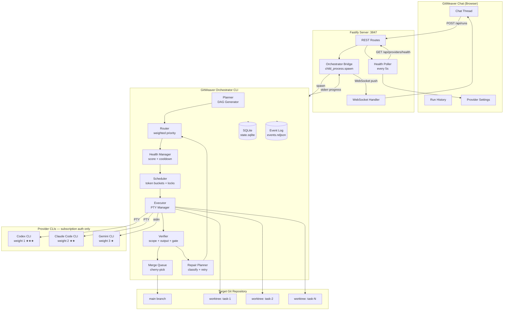

---

## 2. Full Run Lifecycle

End-to-end flow from user prompt to completed or failed run.

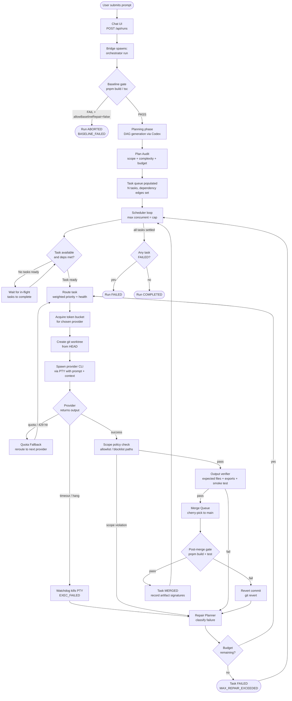

---

## 3. Provider Routing — Weighted Fallback System

The core routing logic. Every task goes through this on initial assignment and again if a provider degrades mid-run.

**Weight table (lower = more generous quota, prefer first):**
| Provider | Weight | Fallback order when unavailable |
|----------|--------|--------------------------------|
| Codex CLI | 1 | Claude → Gemini |
| Claude Code | 2 | Codex → Gemini |
| Gemini CLI | 3 | Codex → Claude |

> **Known gap in current code:** `FALLBACK_ORDER.gemini` is currently `["claude", "codex"]` — one character swap needed to `["codex", "claude"]` to match the weight system. All other orders are already correct.

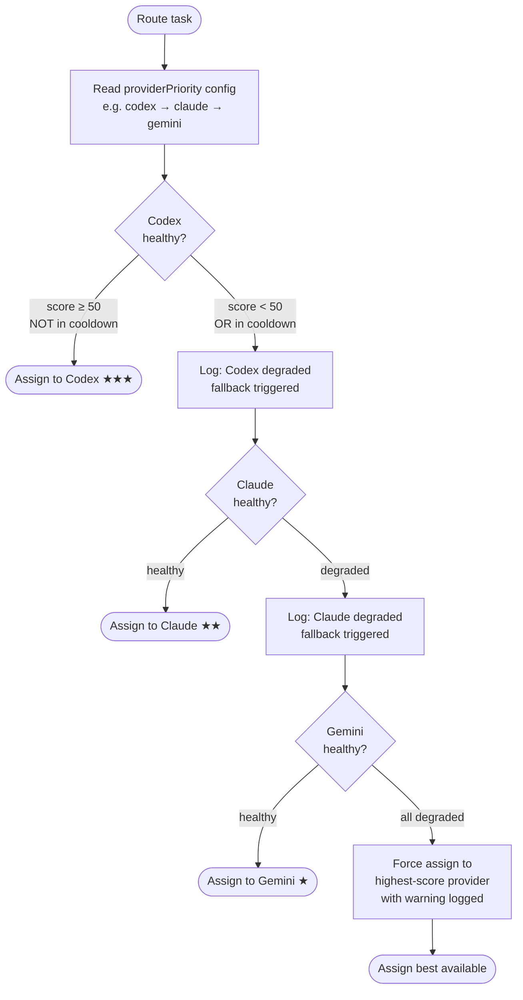

---

## 4. Quota Hit Detection & Recovery Timeline

What happens the moment a provider returns a quota error, and how it recovers.

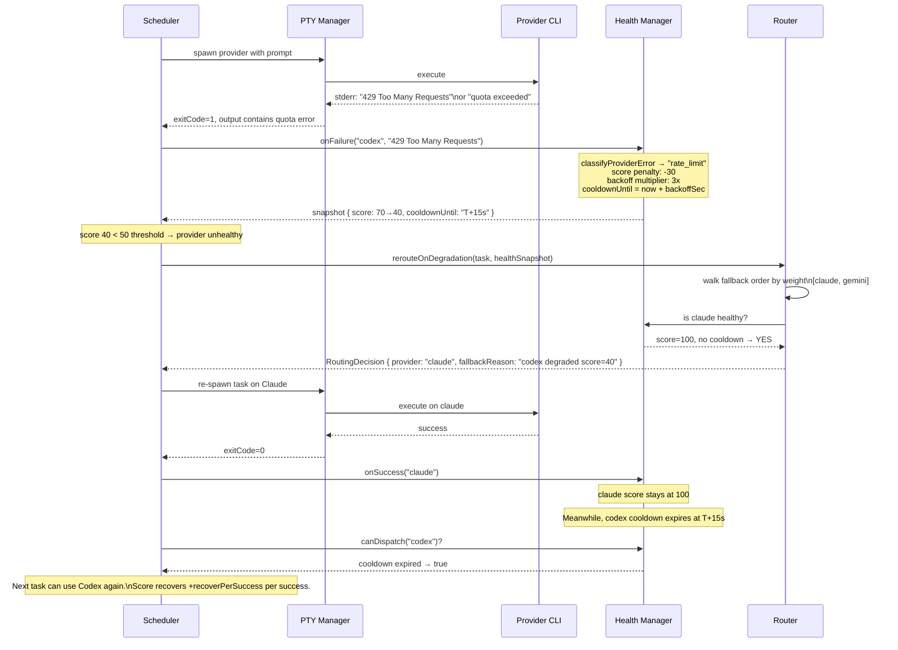

---

## 5. Claude Sub-Model Selection

Claude Code CLI supports three models. GitWeaver can select based on task complexity, conserving Opus quota for tasks that need it and using Haiku to extend overall capacity.

**Model tiers:**
| Model | Best for | Quota cost | Flag |
|-------|---------|-----------|------|
| Opus 4.6 | Complex architecture, multi-file redesign, planning | Highest | `--model claude-opus-4-6` |
| Sonnet 4.6 | Standard code, refactor, tests, bug fixes | Medium | `--model claude-sonnet-4-6` (default) |
| Haiku 4.5 | Boilerplate, fixtures, simple docs, formatting | Lowest | `--model claude-haiku-4-5` |

> Haiku use case for subscription users: when running a large batch of tasks, routing simple/repetitive tasks to Haiku conserves your Sonnet/Opus quota for the tasks where quality actually matters. Haiku is also the fastest — good for repair attempts on trivial failures.

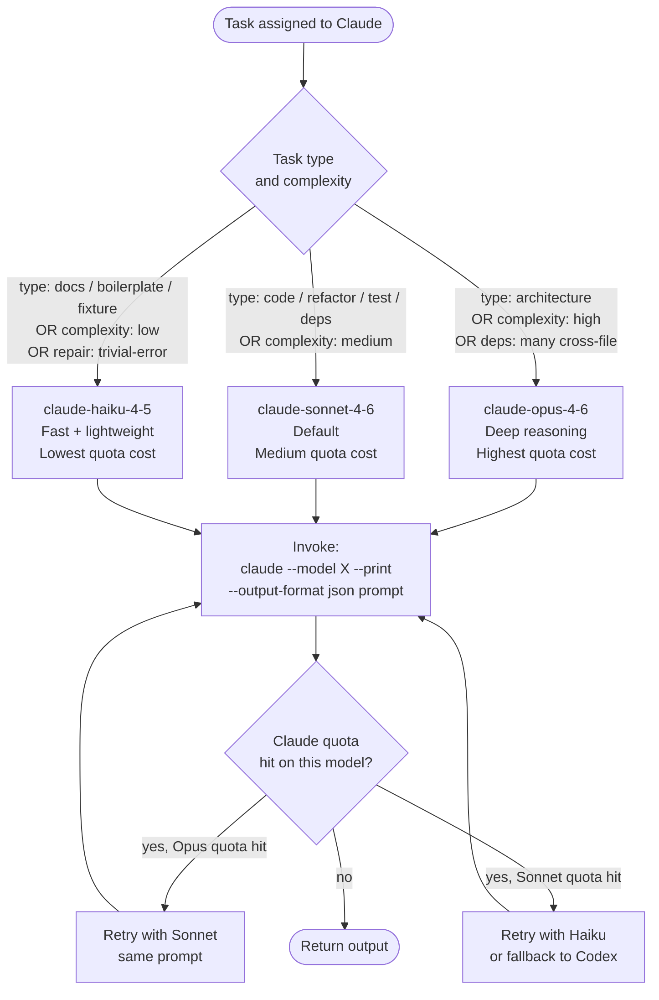

---

## 6. Task Execution Pipeline (Detailed)

Inside a single task — from assignment to merged commit.

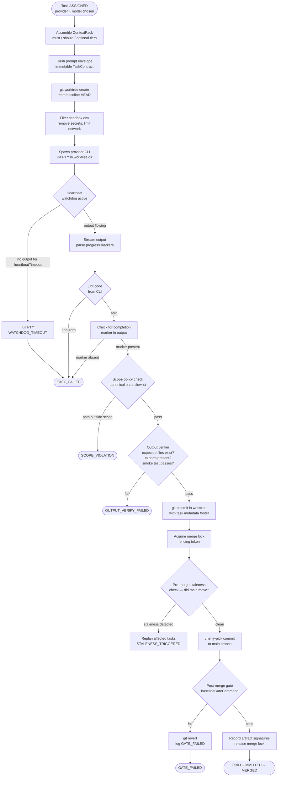

---

## 7. Agent Coordination Model

**Critical concept:** providers never talk to each other. There is no agent-to-agent communication channel. Coordination is entirely through the orchestrator and git. Think of it as isolated offices sharing a single codebase through code review.

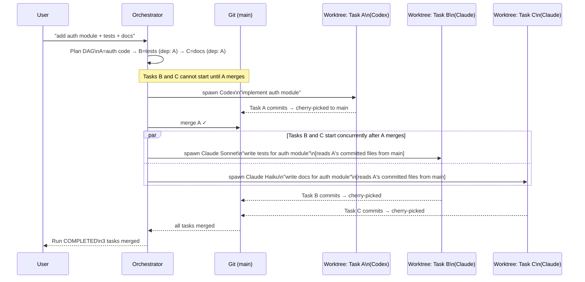

Key rules:
- Providers operate in **complete isolation** in separate git worktrees
- Task B sees Task A's output **only after** A has been cherry-picked to main and B's worktree context is assembled
- The **DAG dependency edges** are the only coordination mechanism — not message passing
- The orchestrator is the **sole mediator** between all agents

---

## 8. Resume & Recovery Flow

What happens when a run crashes mid-execution and is resumed.

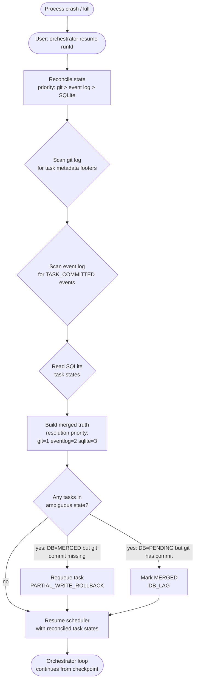

---

## 9. Quota Fallback Weight Reference Card

Quick visual reference for the full fallback matrix at a glance.

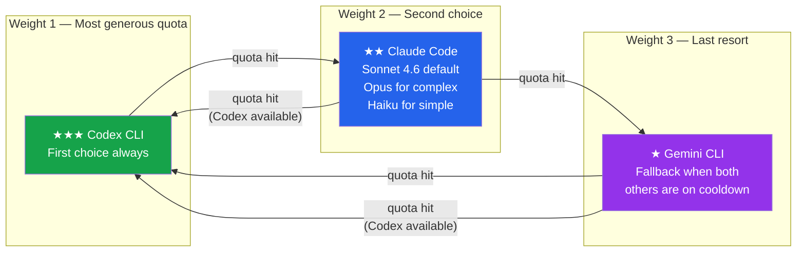

---

## 10. Reasoning Level & Model Selection (Desired — Not Yet Implemented)

Each provider exposes controls for how hard it thinks. Using lower reasoning on simple tasks saves quota for complex ones. **None of this exists in the codebase today** — `ProviderExecutionRequest` has no `reasoningLevel` or `model` field, and `TaskContract` has no `complexity` field. This is the next meaningful feature gap after the one-line fallback fix.

### Per-Provider Reasoning Controls

| Provider | Control | Values | CLI flag (approximate) |
|----------|---------|--------|----------------------|
| **Codex** | Reasoning effort | `low` · `medium` · `high` · `extra-high` | `--reason <level>` |
| **Claude Code** | Model tier | `haiku-4-5` · `sonnet-4-6` · `opus-4-6` | `--model <model>` |
| **Gemini** | Model tier | `flash` · `pro` | `--model <model>` |

### Task Complexity → Provider Settings Mapping

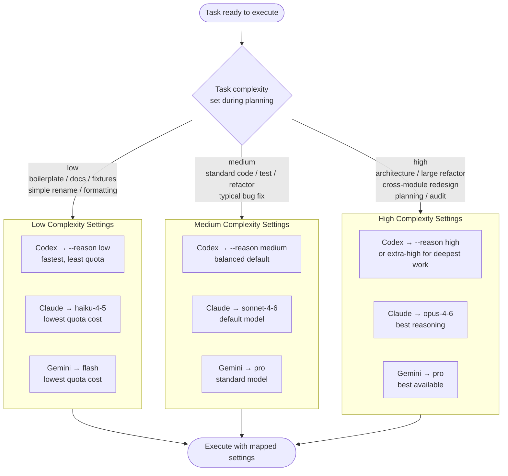

### What Needs to Be Added to the Codebase

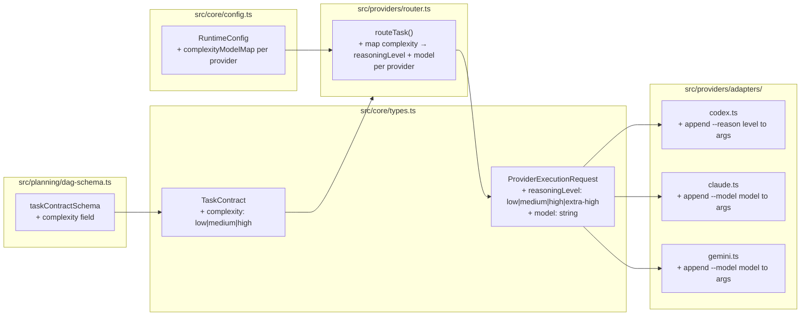

### Quota Cost Comparison (Illustrative)

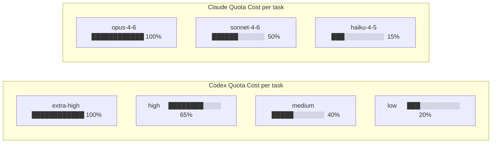

---

## 11. Known Gaps — Implementation Backlog

### Gap 1 — One-Line Fix (router.ts)

```
src/providers/router.ts, line 6

Current (wrong):
  gemini: ["claude", "codex"]

Correct (matches weight system — Codex=1 beats Claude=2):
  gemini: ["codex", "claude"]
```

When Gemini hits quota, it should prefer Codex (weight 1) over Claude (weight 2). All other fallback orders are already correct. This is a one-line change.

---

### Gap 2 — Reasoning Level & Model Selection (multi-file feature)

**Scope:** `types.ts`, `dag-schema.ts`, `router.ts`, `config.ts`, `codex.ts`, `claude.ts`, `gemini.ts`

**What's missing:**
- `TaskContract` has no `complexity` field — the planner never declares how hard a task is
- `ProviderExecutionRequest` has no `reasoningLevel` or `model` field — adapters can't vary their CLI args
- Adapters use hardcoded arg arrays — no reasoning/model flags are ever passed
- No config section for mapping complexity tiers to per-provider models

**Impact without it:** Every task runs at default reasoning/model regardless of complexity. Simple boilerplate tasks consume the same quota as architectural redesigns.

**Impact with it:** Simple tasks use Codex low / Claude Haiku / Gemini Flash → dramatically extends effective daily usage across all three $20 subscriptions.
